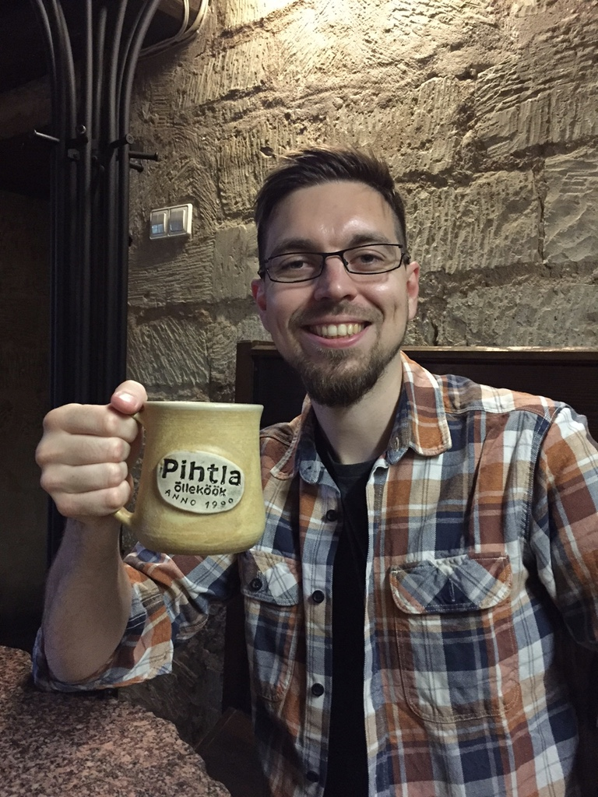

# SF Space

## About Me

* Cosmologist and Python enthusiast.

* Postdoctoral researcher in the <a href="http://www.cosmostat.org/" target="_blank">CosmoStat</a> group at CEA-Saclay. Currently working on deconvolution of galaxy images.

## Research Interests

Prior to joining the CosmoStat team my work was primarily focused on the optical detection and analysis of clusters of galaxies using photometric redshifts. During my PhD I developed a prototype friends-of-friends optical cluster detection algorithm that was further developed and optimised during postdoc positions in Barcelona and Trieste. I also developed serval metrics and analysis codes designed to compare the relative performance of various different cluster detection codes on Euclid mock galaxy simulations.

I am currently working on galaxy image deconvolution using regularization techniques such as sparsity and low-rank approximation.
The idea being to remove the effects of a point spread function (PSF) that varies as function of position on the sky. This is beneficial for projects like Euclid that aim to measure galaxy shapes to good accuracy.

Check out my [CV](CV.md) to find out more.

## Contact Information

* Email: samuel [*dot*] farrens [*at*] cea [*dot*] fr

* Phone: +33 01 69 08 83 77

* Fax: +33 01 69 08 65 77

* Address:  
  Service d'Astrophysique, CEA Saclay,  
  Orme des Merisiers, Building 709  
  F-91191 Gif-sur-Yvette, France
